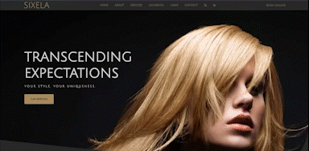

# [Sixela Salon](https://alexisintech.github.io/sixela/)
~ Sixela Salon has passionate, exceptionally experienced beauticians waiting to make your visions come to life! ~

  

## How It's Made:

**Tech used:** HTML, CSS   

All images from [unsplash](https://unsplash.com/)

## Optimizations

Responsive to most screen sizes.

## Lessons Learned:

This was a great project for practicing my design, CSS, and flexbox skills. I really struggled with the media queries on this one. Most specifically, the "coupon" section, because there were multiple elements that depended on the sizing and position of the others. It was difficult to figure out, but I definitely feel more comfortable with CSS flex and media queries now!
